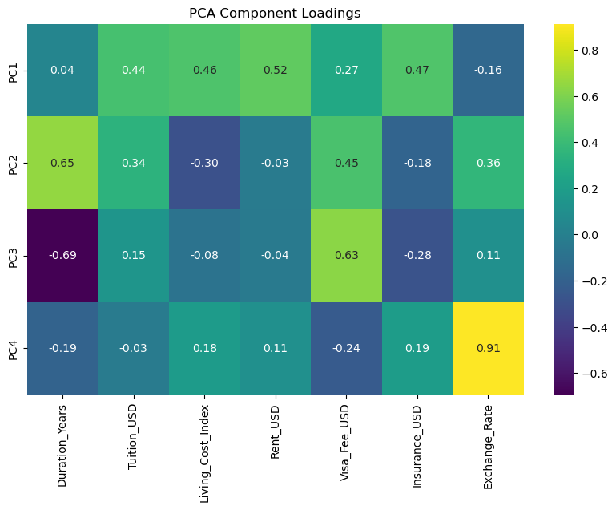

```python
!pip install factor_analyzer
import pandas as pd
import numpy as np
import math
import matplotlib.pyplot as plt
import seaborn as sns
from sklearn.preprocessing import StandardScaler
from sklearn.decomposition import PCA
from sklearn.model_selection import train_test_split
from scipy.stats import skew
from sklearn.metrics import accuracy_score, classification_report
from factor_analyzer import FactorAnalyzer
from factor_analyzer.factor_analyzer import calculate_kmo, calculate_bartlett_sphericity
from sklearn.preprocessing import LabelEncoder
from sklearn.discriminant_analysis import LinearDiscriminantAnalysis
from sklearn.preprocessing import StandardScaler, LabelEncoder
from sklearn.cross_decomposition import CCA
```

    Requirement already satisfied: factor_analyzer in c:\programdata\anaconda3\lib\site-packages (0.5.1)
    Requirement already satisfied: pandas in c:\programdata\anaconda3\lib\site-packages (from factor_analyzer) (2.0.3)
    Requirement already satisfied: scipy in c:\programdata\anaconda3\lib\site-packages (from factor_analyzer) (1.11.1)
    Requirement already satisfied: numpy in c:\programdata\anaconda3\lib\site-packages (from factor_analyzer) (1.26.4)
    Requirement already satisfied: scikit-learn in c:\programdata\anaconda3\lib\site-packages (from factor_analyzer) (1.3.0)
    Requirement already satisfied: python-dateutil>=2.8.2 in c:\programdata\anaconda3\lib\site-packages (from pandas->factor_analyzer) (2.8.2)
    Requirement already satisfied: pytz>=2020.1 in c:\programdata\anaconda3\lib\site-packages (from pandas->factor_analyzer) (2023.3.post1)
    Requirement already satisfied: tzdata>=2022.1 in c:\programdata\anaconda3\lib\site-packages (from pandas->factor_analyzer) (2023.3)
    Requirement already satisfied: joblib>=1.1.1 in c:\programdata\anaconda3\lib\site-packages (from scikit-learn->factor_analyzer) (1.2.0)
    Requirement already satisfied: threadpoolctl>=2.0.0 in c:\programdata\anaconda3\lib\site-packages (from scikit-learn->factor_analyzer) (2.2.0)
    Requirement already satisfied: six>=1.5 in c:\programdata\anaconda3\lib\site-packages (from python-dateutil>=2.8.2->pandas->factor_analyzer) (1.16.0)
    


```python
# Load the dataset
file_name = 'International_Education_Costs.csv'
df = pd.read_csv(file_name)
```


```python
#checking null values
df.isnull().sum()
```


    Country              0
    City                 0
    University           0
    Program              0
    Level                0
    Duration_Years       0
    Tuition_USD          0
    Living_Cost_Index    0
    Rent_USD             0
    Visa_Fee_USD         0
    Insurance_USD        0
    Exchange_Rate        0
    dtype: int64


```python
# Drop Null Values
df.dropna(inplace=True)
```


```python
# Select only continuous (numeric) columns in the new dataset
continuous_cols = [
    'Duration_Years','Tuition_USD','Living_Cost_Index','Rent_USD','Visa_Fee_USD','Insurance_USD','Exchange_Rate']
X = df[continuous_cols]
```


```python
#Plot histograms of Numarical Variables
n_cols = 3
cols_to_plot = [col for col in continuous_cols if col != 'Exchange_Rate']
n_plots = len(cols_to_plot)
n_rows = math.ceil(n_plots / n_cols)

fig, axes = plt.subplots(nrows=n_rows, ncols=n_cols, figsize=(6*n_cols, 4*n_rows))
axes = axes.flatten()  # Flatten in case of single row

# Plot histograms
for i, col in enumerate(cols_to_plot):
    sns.histplot(df[col].dropna(), kde=True, ax=axes[i])
    axes[i].set_title(f'Histogram of {col}')

# Hide any unused subplots
for i in range(n_plots, len(axes)):
    axes[i].set_visible(False)

plt.tight_layout()
plt.show()
```


    

    


```python
# Correct skewness
for col in continuous_cols:
    if skew(df[col]) > 1:
        df[col] = np.log1p(df[col])
    elif skew(df[col]) < -1:
        df[col] = np.log1p(df[col].max() + 1 - df[col])
```


```python
# Plot boxplots
fig, axes = plt.subplots(nrows=2, ncols=4, figsize=(12, 6))
for ax, col in zip(axes.flatten(), continuous_cols):
    sns.boxplot(x=df[col], ax=ax)
    ax.set_title(f'Boxplot of {col}')
plt.tight_layout()
plt.show()
```


    

    


```python
# Drop outliers using IQR method
Q1 = df[continuous_cols].quantile(0.25)
Q3 = df[continuous_cols].quantile(0.75)
IQR = Q3 - Q1
df = df[~((df[continuous_cols] < (Q1 - 1.5 * IQR)) | (df[continuous_cols] > (Q3 + 1.5 * IQR))).any(axis=1)]
```


```python
# Standardize the data
scaler = StandardScaler()
X_scaled = scaler.fit_transform(X)
```

##Principal Component Analysis (PCA)


```python
# Apply PCA
n_components = 7
pca = PCA(n_components=n_components)
X_pca = pca.fit_transform(X_scaled)

# Create a DataFrame with principal components
pca_df = pd.DataFrame(X_pca, columns=[f'PC{i+1}' for i in range(n_components)])

# Print explained variance
print("Explained variance ratio for each component:")
for i, var in enumerate(pca.explained_variance_ratio_):
    print(f"PC{i+1}: {var:.2%}")
print(f"Total explained variance: {pca.explained_variance_ratio_.sum():.2%}")
```

    Explained variance ratio for each component:
    PC1: 46.87%
    PC2: 15.80%
    PC3: 13.90%
    PC4: 13.14%
    PC5: 6.38%
    PC6: 2.76%
    PC7: 1.14%
    Total explained variance: 100.00%
    


```python
# Fit PCA without specifying n_components to get all components
pca_full = PCA()
pca_full.fit(X_scaled)
explained = pca_full.explained_variance_ratio_ * 100

plt.figure(figsize=(6, 4))
components = range(1, len(explained) + 1)

# Plot bars
plt.bar(components, explained, alpha=0.6, label='Explained Variance (Bar)')

# Plot line for explained variance
plt.plot(components, explained, marker='o', linestyle='-', color='r', label='Explained Variance (Line)')

plt.title('Scree Plot: Explained Variance by PCA Components')
plt.xlabel('Principal Component')
plt.ylabel('Explained Variance (%)')
plt.xticks(components)
plt.legend()
plt.grid(True)
plt.tight_layout()
plt.show()
```


    

    


```python
# Apply PCA with 4 components
pca = PCA(n_components=4)
pca_components = pca.fit_transform(X_scaled)
pca_df = pd.DataFrame(pca_components, columns=['PC1', 'PC2', 'PC3','PC4'])

# Explained variance
explained_variance_pct = pca.explained_variance_ratio_ * 100
total_variance = explained_variance_pct.sum()
print("\nTotal Explained Variance by First 4 Components: {:.1f}%".format(total_variance))

# PCA component loadings
print("\nPCA Component Loadings:")
loadings = pd.DataFrame(pca.components_, columns=continuous_cols, index=['PC1', 'PC2', 'PC3','PC4'])
print(loadings)
```

    
    Total Explained Variance by First 4 Components: 89.7%
    
    PCA Component Loadings:
         Duration_Years  Tuition_USD  Living_Cost_Index  Rent_USD  Visa_Fee_USD  \
    PC1        0.039285     0.439024           0.461094  0.522571      0.270602   
    PC2        0.652231     0.340348          -0.296600 -0.034592      0.452614   
    PC3       -0.692552     0.145239          -0.082481 -0.040336      0.633216   
    PC4       -0.185365    -0.033874           0.180156  0.108400     -0.235187   
    
         Insurance_USD  Exchange_Rate  
    PC1       0.471944      -0.155144  
    PC2      -0.183290       0.362127  
    PC3      -0.280413       0.106077  
    PC4       0.185353       0.911382  
    


```python
# Heatmap of the PCA component loadings
plt.figure(figsize=(10, 6))
sns.heatmap(loadings, annot=True, cmap='viridis', fmt='.2f')
plt.title('PCA Component Loadings')
plt.show()
```


    

    


##Factor Analysis


```python
financial_cols = [
    'Tuition_USD', 'Rent_USD', 'Insurance_USD', 'Visa_Fee_USD', 'Living_Cost_Index', 'Exchange_Rate']
df_fa = df[financial_cols].dropna()

# Correlation Matrix
plt.figure(figsize=(8,6))
sns.heatmap(df_fa.corr(), annot=True, cmap='coolwarm')
plt.title("Correlation Matrix of Financial Variables")
plt.show()

# KMO and Bartlett’s Test
kmo_all, kmo_model = calculate_kmo(df_fa)
print("KMO Test Value:", round(kmo_model, 2))
chi_square_value, p_value = calculate_bartlett_sphericity(df_fa)
print("Bartlett’s test: chi-square =", round(chi_square_value,2), "p-value =", round(p_value,4))

# Scree Plot
fa = FactorAnalyzer(rotation=None)
fa.fit(df_fa)
ev, v = fa.get_eigenvalues()
plt.scatter(range(1, len(ev)+1), ev)
plt.plot(range(1, len(ev)+1), ev)
plt.title('Scree Plot')
plt.xlabel('Factors')
plt.ylabel('Eigenvalue')
plt.grid()
plt.show()

# Factor Analysis
n_factors = 2
fa = FactorAnalyzer(n_factors=n_factors, rotation='varimax')
fa.fit(df_fa)
loadings = pd.DataFrame(fa.loadings_, index=financial_cols, columns=[f'Factor{i+1}' for i in range(n_factors)])
print("\nFactor Loadings:\n", loadings.round(3))
variance = pd.DataFrame(
    fa.get_factor_variance(),
    index=['SS Loadings', 'Proportion Var', 'Cumulative Var'],
    columns=[f'Factor{i+1}' for i in range(n_factors)]
)
print("\nVariance Explained:\n", variance.round(3))

```


    

    


    KMO Test Value: 0.68
    Bartlett’s test: chi-square = 2817.63 p-value = 0.0
    


    

    


    
    Factor Loadings:
                        Factor1  Factor2
    Tuition_USD          0.284    0.957
    Rent_USD             0.740    0.557
    Insurance_USD        0.834    0.282
    Visa_Fee_USD         0.106    0.446
    Living_Cost_Index    0.948    0.171
    Exchange_Rate       -0.558   -0.139
    
    Variance Explained:
                     Factor1  Factor2
    SS Loadings       2.545    1.552
    Proportion Var    0.424    0.259
    Cumulative Var    0.424    0.683
    

##Discriminant Analysis (LDA)


```python
# Calculate total cost for target variable
df['Total_Cost_USD'] = (df['Tuition_USD'] + (df['Rent_USD'] * 12 * df['Duration_Years']) +
    (df['Insurance_USD'] * df['Duration_Years']) + df['Visa_Fee_USD'])

#Check min and max for define the bins
#print("Min:", df['Total_Cost_USD'].min())
#print("Max:", df['Total_Cost_USD'].max())


# Define the bins and labels
bins = [0, 20000, 50000, 200000]
labels = ['Low', 'Medium', 'High']

df['cost_cat'] = pd.cut(df['Total_Cost_USD'], bins=bins, labels=labels, include_lowest=True)

# Choose features (excluding target and highly correlated columns)
categorical_cols = ['Country', 'City', 'University', 'Program', 'Level']
numerical_cols = [
    'Duration_Years', 'Tuition_USD', 'Living_Cost_Index', 'Rent_USD',
    'Visa_Fee_USD', 'Insurance_USD', 'Exchange_Rate']

# Encode categorical features
df_encoded = df.copy()
for col in categorical_cols:
    df_encoded[col] = LabelEncoder().fit_transform(df_encoded[col].astype(str))

X = df_encoded[categorical_cols + numerical_cols]
y = df['cost_cat']


# Remove missing target values
mask = y.notna()
X = X[mask]
y = y[mask]

# Encode target
le = LabelEncoder()
y_encoded = le.fit_transform(y)

# Split data
X_train, X_test, y_train, y_test = train_test_split(
    X, y_encoded, test_size=0.3, random_state=42, stratify=y_encoded
)

# Fit LDA
lda = LinearDiscriminantAnalysis()
lda.fit(X_train, y_train)
y_pred = lda.predict(X_test)

print("\nDiscriminant Analysis Accuracy:", accuracy_score(y_test, y_pred))
print("\nClassification Report:")
print(classification_report(y_test, y_pred, target_names=le.classes_))

# Get loadings (coefficients) for each discriminant function
loadings = pd.DataFrame(
    lda.coef_.T,
    index=X_train.columns,
    columns=[f'LD{i+1}' for i in range(lda.coef_.shape[0])]
)
print("LDA Loadings (Coefficients for each Linear Discriminant Function):")
print(loadings)

```

    
    Discriminant Analysis Accuracy: 0.8571428571428571
    
    Classification Report:
                  precision    recall  f1-score   support
    
            High       1.00      0.89      0.94        84
             Low       0.71      0.79      0.75        38
          Medium       0.80      0.85      0.83        81
    
        accuracy                           0.86       203
       macro avg       0.84      0.84      0.84       203
    weighted avg       0.87      0.86      0.86       203
    
    LDA Loadings (Coefficients for each Linear Discriminant Function):
                            LD1       LD2       LD3
    Country           -0.026809  0.061993 -0.001063
    City               0.000521 -0.000665 -0.000230
    University         0.000152  0.000305 -0.000300
    Program            0.007375 -0.003421 -0.006056
    Level             -0.336077  0.519580  0.106604
    Duration_Years     1.286223 -1.586156 -0.595334
    Tuition_USD        0.000226 -0.000191 -0.000145
    Living_Cost_Index  0.103693 -0.171875 -0.027506
    Rent_USD           0.001928 -0.002055 -0.001042
    Visa_Fee_USD       0.007784 -0.007411 -0.004622
    Insurance_USD     -1.159907 -0.368093  1.374253
    Exchange_Rate     -0.002735 -0.015556  0.010079
    

##Canonical Correlation Analysis (CCA)

Choose Two Sets of Variables

Set X (e.g., program characteristics):Duration_Years, Level, Program, University (after encoding categorical columns)

Set Y (e.g., cost variables):Tuition_USD, Rent_USD, Insurance_USD, Visa_Fee_USD, Living_Cost_Index


```python
# Encode categorical variables for X set
categorical_X = ['Level', 'Program', 'University']
df_encoded = df.copy()
for col in categorical_X:
    df_encoded[col] = LabelEncoder().fit_transform(df_encoded[col].astype(str))

# Define X and Y sets
X = df_encoded[['Duration_Years', 'Level', 'Program', 'University']]
Y = df_encoded[['Tuition_USD', 'Rent_USD', 'Insurance_USD', 'Visa_Fee_USD', 'Living_Cost_Index']]

# Drop missing values
X = X.dropna()
Y = Y.loc[X.index]  # Ensure alignment

# Standardize
scaler = StandardScaler()
X_std = scaler.fit_transform(X)
Y_std = scaler.fit_transform(Y)

# --- Canonical Correlation Analysis ---
cca = CCA(n_components=min(X_std.shape[1], Y_std.shape[1]))
cca.fit(X_std, Y_std)
X_c, Y_c = cca.transform(X_std, Y_std)

# --- Canonical coefficients (loadings) for each variable in both sets ----
X_loadings = pd.DataFrame(
    cca.x_weights_,
    index=X.columns,
    columns=[f'U{i+1}' for i in range(cca.n_components)]
)
print("\nCanonical Coefficients for X Set (Program Characteristics):")
print(X_loadings.round(4).to_string())

x_combo = " + ".join([f"{X_loadings.iloc[i,0]:.4f}×{X.columns[i]}" for i in range(len(X.columns))])
print(f"\nU₁ = {x_combo}")

Y_loadings = pd.DataFrame(
    cca.y_weights_,
    index=Y.columns,
    columns=[f'V{i+1}' for i in range(cca.n_components)]
)
print("\nCanonical Coefficients for Y Set (Cost Variables):")
print(Y_loadings.round(4).to_string())

y_combo = " + ".join([f"{Y_loadings.iloc[i,0]:.4f}×{Y.columns[i]}" for i in range(len(Y.columns))])
print(f"\nV₁ = {y_combo}")

print('\n' + '-'*100)

# --- Correlations between each variable and each canonical variate ---
# For X variables and U (canonical variates of X)
corrs_X = np.corrcoef(X_std.T, X_c.T)[:X_std.shape[1], X_std.shape[1]:]
corrs_X_df = pd.DataFrame(corrs_X, index=X.columns, columns=[f'U{i+1}' for i in range(X_c.shape[1])])

print("\nCorrelations between X variables and canonical variates (U):")
print(corrs_X_df.round(4).to_string())

# For Y variables and V (canonical variates of Y)
corrs_Y = np.corrcoef(Y_std.T, Y_c.T)[:Y_std.shape[1], Y_std.shape[1]:]
corrs_Y_df = pd.DataFrame(corrs_Y, index=Y.columns, columns=[f'V{i+1}' for i in range(Y_c.shape[1])])

print("\nCorrelations between Y variables and canonical variates (V):")
print(corrs_Y_df.round(4).to_string())

print('\n' + '-'*100)

# --- Correlations between each X variable and all canonical variates for Y (V1, V2, ...) ---
corrs_x_all_v = np.zeros((X_std.shape[1], Y_c.shape[1]))
for i in range(X_std.shape[1]):
    for j in range(Y_c.shape[1]):
        corrs_x_all_v[i, j] = np.corrcoef(X_std[:, i], Y_c[:, j])[0, 1]
corrs_x_all_v_df = pd.DataFrame(
    corrs_x_all_v,
    index=X.columns,
    columns=[f'V{j+1}' for j in range(Y_c.shape[1])]
)
print("\nCorrelations between each X variable and all canonical variates for Y (V₁, V₂, ...):")
print(corrs_x_all_v_df.round(4).to_string())

# --- Correlations between each Y variable and all canonical variates for X (U1, U2, ...) ---
corrs_y_all_u = np.zeros((Y_std.shape[1], X_c.shape[1]))
for i in range(Y_std.shape[1]):
    for j in range(X_c.shape[1]):
        corrs_y_all_u[i, j] = np.corrcoef(Y_std[:, i], X_c[:, j])[0, 1]
corrs_y_all_u_df = pd.DataFrame(
    corrs_y_all_u,
    index=Y.columns,
    columns=[f'U{j+1}' for j in range(X_c.shape[1])]
)
print("\nCorrelations between each Y variable and all canonical variates for X (U₁, U₂, ...):")
print(corrs_y_all_u_df.round(4).to_string())


```

    
    Canonical Coefficients for X Set (Program Characteristics):
                        U1      U2      U3      U4
    Duration_Years -0.6829 -0.4628  0.5536  0.1142
    Level           0.1248  0.4838  0.4000  0.7683
    Program         0.7035 -0.3994  0.5664 -0.1577
    University     -0.1525  0.6263  0.4613 -0.6097
    
    U₁ = -0.6829×Duration_Years + 0.1248×Level + 0.7035×Program + -0.1525×University
    
    Canonical Coefficients for Y Set (Cost Variables):
                           V1      V2      V3      V4
    Tuition_USD       -0.5653 -0.5470 -0.4615 -0.1231
    Rent_USD          -0.5247  0.6489 -0.0885  0.5044
    Insurance_USD     -0.0678 -0.3327  0.7685  0.3140
    Visa_Fee_USD      -0.0596  0.4078  0.1983 -0.7466
    Living_Cost_Index  0.6301  0.0523 -0.3863  0.2728
    
    V₁ = -0.5653×Tuition_USD + -0.5247×Rent_USD + -0.0678×Insurance_USD + -0.0596×Visa_Fee_USD + 0.6301×Living_Cost_Index
    
    ----------------------------------------------------------------------------------------------------
    
    Correlations between X variables and canonical variates (U):
                        U1      U2      U3      U4
    Duration_Years -0.6470 -0.4957  0.5687  0.1108
    Level           0.1452  0.4370  0.4814  0.7458
    Program         0.7069 -0.4128  0.5536 -0.1530
    University     -0.1876  0.6734  0.4015 -0.5918
    
    Correlations between Y variables and canonical variates (V):
                           V1      V2      V3      V4
    Tuition_USD       -0.9271 -0.0236 -0.0290  0.1878
    Rent_USD          -0.6081  0.3560  0.1147  0.6799
    Insurance_USD     -0.3332 -0.0204  0.5464  0.6764
    Visa_Fee_USD      -0.4539  0.6718  0.2055 -0.3772
    Living_Cost_Index -0.1175  0.3367  0.1478  0.7718
    
    ----------------------------------------------------------------------------------------------------
    
    Correlations between each X variable and all canonical variates for Y (V₁, V₂, ...):
                        V1      V2      V3      V4
    Duration_Years -0.2241 -0.1000  0.0375  0.0024
    Level           0.0503  0.0882  0.0318  0.0161
    Program         0.2449 -0.0833  0.0365 -0.0033
    University     -0.0650  0.1359  0.0265 -0.0127
    
    Correlations between each Y variable and all canonical variates for X (U₁, U₂, ...):
                           U1      U2      U3      U4
    Tuition_USD       -0.3211 -0.0047 -0.0019  0.0040
    Rent_USD          -0.2106  0.0719  0.0076  0.0146
    Insurance_USD     -0.1154 -0.0041  0.0361  0.0146
    Visa_Fee_USD      -0.1572  0.1356  0.0136 -0.0081
    Living_Cost_Index -0.0407  0.0680  0.0098  0.0166
    


```python
# Plot first canonical variates (U1 vs V1)
plt.figure(figsize=(8,6))
plt.scatter(X_c[:, 0], Y_c[:, 0], alpha=0.7, color='blue')
plt.title('Scatter plot of First Canonical Variates (U1 vs V1)')
plt.xlabel('U1 (First Canonical Variate of X)')
plt.ylabel('V1 (First Canonical Variate of Y)')
plt.grid(True)
plt.show()

# Plot second canonical variates (U2 vs V2)
plt.figure(figsize=(8,6))
plt.scatter(X_c[:, 1], Y_c[:, 1], alpha=0.7, color='green')
plt.title('Scatter plot of Second Canonical Variates (U2 vs V2)')
plt.xlabel('U2 (Second Canonical Variate of X)')
plt.ylabel('V2 (Second Canonical Variate of Y)')
plt.grid(True)
plt.show()
```


    

    


    

    


```python

```
